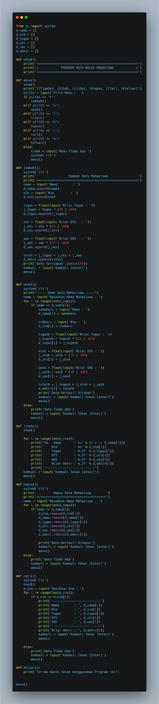
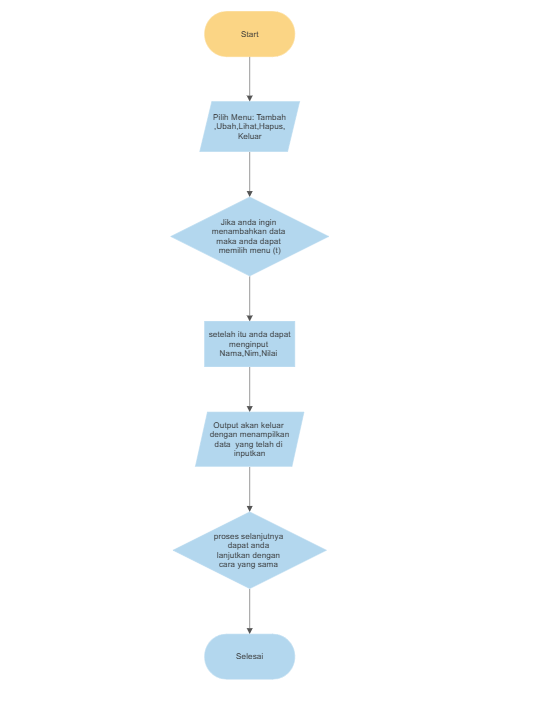

# Praktikum6

# Pengertian Fungsi (def) Pada Python
Apa itu fungsi (def) pada python?
Fungsi pada python adalah kumpulan perintah atau baris kode yang dikelompokkan menjadi satu kesatuan untuk kemudian bisa dipanggil atau digunakan berkali-kali.
Kenapa memangnya kalau tidak menggunakan fungsi?
Bisa jadi kita akan kerepotan menulis kode programnya, karena banyak yang harus ditulis dan kode akan menjadi sulit dibaca dan dirawat (maintenance).
Dengan fungsi, kita dapat memecah program besar menjadi sub program yang lebih sederhana.

# Praktikum
Buat program sederhana dengan mengaplikasikan penggunaan fungsi yang akan menampilkan daftar nilai mahasiswa, dengan ketentuan:
• Fungsi tambah() untuk menambah data
• Fungsi lihat() untuk menampilkan data
• Fungsi hapus(nama) untuk menghapus data berdasarkan nama
• Fungsi ubah(nama) untuk mengubah data berdasarkan nama

Berikut kodingan dari program di atas

from os import system
d_nama = []
d_nim = []
d_tugas = []
d_uts = []
d_uas = []
d_akhir = []

def show():
    print('======================================================')
    print('|            PROGRAM DATA NILAI MAHASISWA            |')
    print('======================================================')

def menu():
    show()
    print('[(T)ambah, (U)bah, (L)ihat, (H)apus, (C)ari, (K)eluar]')
    pilih2 = input('Pilih Menu :  ')
    if pilih2 == 't':
        tambah()
    elif pilih2 == 'u':
        ubah()
    elif pilih2 == 'l':
        lihat()
    elif pilih2 == 'h':
        hapus()
    elif pilih2 == 'c':
        cari()
    elif pilih2 == 'k':
        keluar()
    else:
        tidak = input('Menu Tidak Ada ')
        system('cls')
        menu()

def tambah():
    system('cls')
    print('                 Tambah Data Mahasiswa                ')
    print('======================================================')
    nama = input('Nama        : ')
    d_nama.append(nama)
    nim = input('Nim         : ')
    d_nim.append(nim)

    tugas = float(input('Nilai Tugas : '))
    j_tugas = tugas * (30 / 100)
    d_tugas.append(j_tugas)

    uts = float(input('Nilai UTS   : '))
    j_uts = uts * (35 / 100)
    d_uts.append(j_uts)

    uas = float(input('Nilai UAS   : '))
    j_uas = uas * (35 / 100)
    d_uas.append(j_uas)

    total = j_tugas + j_uts + j_uas
    d_akhir.append(total)
    print('Data Tersimpan'.center(40))
    kembali = input('Kembali [enter]')
    menu()

def ubah():
    system('cls')
    print("----- Ubah Data Mahasiswa -----")
    namm = input('Masukkan Nama Mahasiswa : ')
    for i in range(len(d_nama)):
        if namm == d_nama[i]:
            namabaru = input('Nama : ')
            d_nama[i] = namabaru

            nimbaru = input('Nim : ')
            d_nim[i] = nimbaru

            tugasb = float(input('Nilai Tugas : '))
            j_tugasb = tugasb * (35 / 100)
            d_tugas[i] = j_tugasb

            utsb = float(input('Nilai UTS : '))
            j_utsb = utsb * (35 / 100)
            d_uts[i] = j_utsb

            uasb = float(input('Nilai UAS : '))
            j_uasb = uasb * (30 / 100)
            d_uas[i] = j_uasb

            totalb = j_tugasb + j_utsb + j_uasb
            d_akhir[i] = totalb
            print('Data Berhasil Dirubah')
            kembali = input('Kembali Tekan [enter]')
            menu()
    else:
        print('Data Tidak Ada')
        kembali = input('Kembali Tekan [Enter]')
        menu()

def lihat():
    show()

    for i in range(len(d_nim)):
        print('%d.  Nama       : %s' % (i + 1, d_nama[i]))
        print('    Nim         : %s' % d_nim[i])
        print('    Tugas       : %.2f' % d_tugas[i])
        print('    UTS         : %.2f' % d_uts[i])
        print('    UAS         : %.2f' % d_uas[i])
        print('    Nilai Akhir : %.2f' % d_akhir[i])
        print('---------------------------')
    kembali = input('Kembali Tekan [enter]')
    menu()

def hapus():
    system('cls')
    print('         Hapus Data Mahasiswa        ')
    print('=====================================')
    namm = input('Masukkan Nama Mahasiswa : ')
    for i in range(len(d_nama)):
        if namm == d_nama[i]:
            d_nim.remove(d_nim[i])
            d_nama.remove(d_nama[i])
            d_tugas.remove(d_tugas[i])
            d_uts.remove(d_uts[i])
            d_uas.remove(d_uas[i])
            d_akhir.remove(d_akhir[i])

            print('Data Berhasil Dihapus')
            kembali = input('Kembali Tekan [enter]')
            menu()
    else:
        print('Data Tidak Ada')
        kembali = input('Kembali Tekan [Enter]')
        menu()

def cari():
    system('cls')
    head()
    m_nim = input('Masukkan Nim : ')
    for i in range(len(d_nim)):
        if m_nim == d_nim[i]:
            print('--------------------------')
            print('Nama        : ', d_nama[i])
            print('Nim         : ', d_nim[i])
            print('Tugas       : ', d_tugas[i])
            print('UTS         : ', d_uts[i])
            print('UAS         : ', d_uas[i])
            print('--------------------------')
            print('Nilai Akhir : ', d_akhir[i])
            kembali = input('Kembali Tekan [Enter]')
            menu()

    else:
        print('Data Tidak Ada')
        kembali = input('Kembali Tekan [Enter]')
        menu()

def keluar():
    print('Terima Kasih telah menggunakan Program ini')

menu()

Penjelasan Program di atas

1. Import os nya menggunakan syntax 'from os import system' : pemanggilan fungsi dengan nama os system('cls') :
clearscreen pada command prompt anda. Memungkinkan kita mengimpor hanya satu definisi (fungsi) Lalu kita buat list kosong untuk di isi oleh tipe data yang sesuai dengan nama list tersebut. Contoh : nama = [] , list tersebut akan kita gunakan untuk menampung data yang berisi nama yang diinput
2. Buat fungsi def menu()
Didalam fungsi def menu, gunakan perulangan if elif else untuk pemberian opsi pilihan bagi pengguna apa yang akan di inputkan. Dan berilah tujuan apa yang diinputkan, contoh : if pilih2 == 't': tambah() elif pilih2 == 'u': ubah() Artinya, jika kita mengetikkan 't' maka akan menuju ke def tambah()

3. Setelah pembuatan menu, buatlah pilihan fungsi def tambah()
Didalam fungsi def tambah itu pengimputan semua data-data seperti nama, nim, tugas, uts, uas bahkan total nilai Apa yang kita inputkan otomatis ditambahkan ke list nya masing masing, contoh : diawal kita sudah inputkan list kosong dengan nama d_nim list ketika dalam penginputan akan disimpan di list tersebut menggunakan syntax d_nim.append

Berikut adalah Output dari di fungsi di atas

4. Setelah memasukkan atau menambahkan data selanjutnya anda dapat mengubah data dengan menggunakan fungsi def ubah(). fungsi ini adalah merubah data yang sudah diinputkan dan disimpan di list yang sama dengan datanya namun diberi parameter (sebutan nilai untuk inputan fungsi pada saat fungsi tersebut di definisikan) data akan dimasukkan ke list yang sama namun di beri parameter [i], contoh semula d_nim[] maka untuk data yang baru akan dimasukan ke d_nim[i]

Berikut adalah output dari fungsi di atas

5. Setelah anda menambahkan data dan merubah data anda juga dapat melihat data dengan menggunakan fungsi def lihat(). fungsinya untuk melihat dan menampilkan data yang sudah di inputkan tadi .

Berikut adalah output dari fungsi diatas

6. Selanjutnya jika anda ingin menghapus data yang sudah di inpput anda dapat menggunakan fungsi def hapus().Di dalam fungsi def ini ketika kita ingin mencari data yang akan dihapus yaitu memanggilnya dengan cara yang sama for i in range(len(d_nama))

Berikut adalah Output dari fungsi di atas

7. Selanjutnya jika anda sudaah melakukan seluruh program hal terakhir di lakukan adalah keluar dari program,untuk keluar dari program tersebut tambahkan fungsi def keluar()
Di dalam fungsi ini tidak ada banyak syntax karna tujuan utamanya untuk keluar dari program.

# FlowChart 

Berikut adalah flowchart program diatas 
1. Mulai
2. Memilih menu Tambah,Ubah,Lihat,hapus,keluar
3. Jika anda ingin menginputkan data makan anda dapat memilih menu (t)
4. Setelah itu anda dapat menginput data mahasiswa seperti Nama,Nim,Nilai
5. Maka Output akan keluar dengan menampilkan data yang telah di inputkan
6. Proses selanjutnya jika anda ingin menggunakan menu yang lain anda dapat melakukan proses dengan cara yang sama 
7. Selesai 

# TERIMA KASIH

